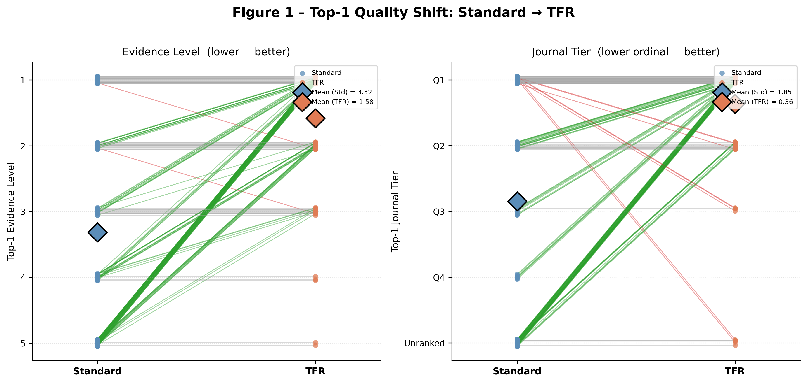
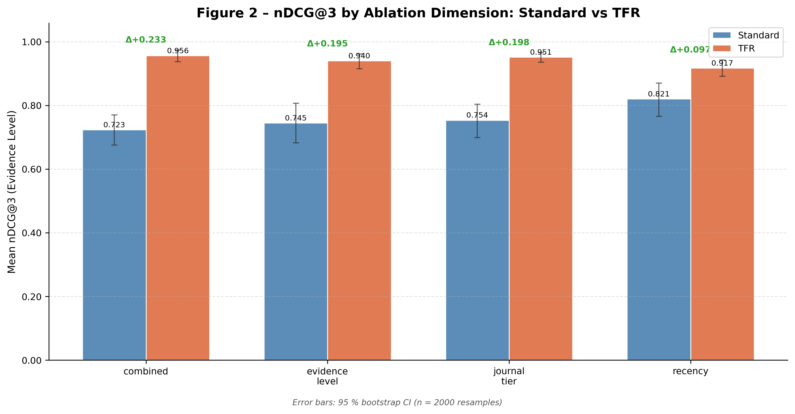

# Traceability-First Retrieval (TFR): Mathematical Evaluation and Ablation of Trust-Weighted Fusion in Clinical RAG

Traditional Retrieval-Augmented Generation (RAG) architectures rely heavily on semantic "closeness" (vector distance), exposing them to the **Semantic Trap**: low-evidence sources (e.g., case reports, expert opinions) can rank higher than high-evidence sources (e.g., systematic reviews, RCTs) simply due to verbose text alignment or keyword density.

TFR resolves this by introducing **Trust-Weighted Ranking (TWR)**, a modular mathematical transformation layer that maps objective clinical authority signals directly onto the retrieval fusion operator.

---

## 1. Core Mathematical Framework

This study evaluates the performance delta between traditional **Reciprocal Rank Fusion (RRF)** and **Trust-Weighted Ranking (TWR)** over an identical candidate pool.

### Baseline: Reciprocal Rank Fusion (RRF)

Standard RRF computes a score based solely on a document's ordinal position within a set of rankers $R$ (e.g., BM25 and FAISS dense embeddings):

$$RRF(d) = \sum_{r \in R} \frac{1}{k + r(d)}$$

Where $r(d)$ is the rank of document $d$ in ranker $r$, and $k$ is a smoothing constant (default: $60$). RRF is blind to document provenance, structural metadata, or truth hierarchies.

### Proposed: Trust-Weighted Ranking (TWR)

TWR optimizes the fusion score by scaling positional consensus with a multi-factor structural authority vector $\Gamma(d)$:

$$TWR(d) = RRF(d) \cdot \Gamma(d)$$

The trust scalar $\Gamma(d)$ maps real-world clinical credentials to a bounded scalar interval $[0.0, 1.0]$:

$$\Gamma(d) = W_{\text{evidence}}(d) \cdot W_{\text{journal}}(d) \cdot e^{-\lambda \cdot (Y_{\text{current}} - Y_{\text{pub}}(d))}$$

Where:

* $W_{\text{evidence}}(d)$: Mapping function for the **Oxford Centre for Evidence-Based Medicine (OCEBM)** hierarchy (e.g., Meta-Analysis / Systematic Review = 1.0; Randomized Controlled Trial = 0.8; Cohort Study = 0.6; Case-Control = 0.4; Case Report / Expert Opinion = 0.2).
* $W_{\text{journal}}(d)$: Normalized **SCImago Journal Rank (SJR)** metric grouping (Q1 = 1.0, Q2 = 0.85, Q3 = 0.70, Q4 = 0.55, Unranked = 0.40).
* $e^{-\lambda \cdot \Delta Y}$: Exponential decay function penalizing outdated clinical data given decay parameter $\lambda$ (default: $0.05$) and the age of the publication $\Delta Y = Y_{\text{current}} - Y_{\text{pub}}(d)$.

---

## 2. Experimental Design & Ablation Protocol

To prove the generalizability and mathematical soundness of TWR, the evaluation engine isolates the fusion mechanism across a curated corpus of domain-stratified PubMed documents spanning multiple distinct biomedical domains.

### The CTE-180 Benchmark Dataset

Evaluation runs utilize the **Clinical Trust Evaluation (CTE-180)** benchmark suite (`queries.json`). This dataset features 180 professional-grade clinical queries stratified across four distinct validation dimensions:

1. `evidence_level`: Verifies the system's ability to prioritize high-level clinical evidence when low-tier documents exhibit high keyword match density.
2. `journal_tier`: Validates the impact of indexing peer-reviewed literature (Q1/Q2) above unranked medical commentary.
3. `multi_factor`: Tests the intersection and compound penalty behavior of multiple overlapping metadata tags.
4. `adversarial`: Specifically targets boundary/corner cases (e.g., rare diseases lacking RCTs or deceptive phrasings) to chart the exact limits of the trust weight bounds.

---

## 3. Directory Structure

```pattern
C:.
│   .env
│   app.py
├───data
│   │   documents.db
│   │   domain.py
│   │   queries.json
│   │   scimagojr_2025.csv
│   └───seed_pubmed_data.xml
├───documentation
│       generate_queries.md
│       paper_draft.md
├───eval
│       run_eval.py
├───infra
│   └── clinical_document.py
├───logs
│       audit_log.csv
│       pipeline_audit_log.csv
├───pipeline
│   │   retrieval.py
│   └── standard_pipeline.py
├───results
│       ablation_summary.csv
│       fig1_dumbbell.png
│       fig2_grouped_bar.png
│       metrics_summary.csv
│       stats_report.txt
└───utils
    ├───api
    │   │   audit.py
    │   └── make_response.py
    ├───data
    │   │   get_pubmed_xml.py
    |   |   seed_database.py
    │   │   ingestion_pipeline.py
    │   └── load_docs.py
    └───pipeline
        │   audit.py
        │   init_pipline.py
        └── init_standard_pipeline.py

```

---

## 4. Reproducibility Guide

### Prerequisites

* Python 3.11
* Access to the NCBI E-utilities API (optional but recommended for future data refreshes)

Configure your environment variables by creating a `.env` file based on the provided `.env.example` template. Ensure you have the necessary permissions to read/write to the specified paths.
### Step 1: Data Preparation

```bash
# Fetch the official 2025 SCImago Journal Rank global collection
curl -L "[https://www.scimagojr.com/journalrank.php?year=2025&out=xls](https://www.scimagojr.com/journalrank.php?year=2025&out=xls)" -o data/scimagojr_2025.csv
```

### Step 2: Requirements Installation

```bash
pip install -r "requirements.txt"
```

### Step 3: Database Ingestion & Seeding

To build the baseline database, execute seed requests to ingest domain-stratified documents directly into the document database. Run the following corpus pipeline initialization scripts:

``` bash
curl -X POST "http://127.0.0.1:8000/seed/batch" -H "Content-Type: application/json" -d "{\"queries_path\": \"./data/seed_queries.json\"}"
```

### Step 4: Running the Ablation Study

Execute the complete matrix evaluation using the core testing runner:

```bash
python ./eval/run_eval.py --queries_path ./data/queries.json --log_path ./pipeline_audit_log.csv --out_dir ./results/
```
or to use the default paths defined in the `.env` file, simply run:
```bash
python ./eval/run_eval.py
```

---

## 5. Queries Distribution

The CTE-180 benchmark suite is systematically split across four analytical validation tracks and three core clinical domains to yield exactly 180 evaluation query vectors:

| Dimension | orthopaedics | pain medicine | rehabilitation | Total Queries |
| --- | --- | --- | --- | --- |
| `evidence_level` | 15 | 15 | 15 | **45** |
| `journal_tier` | 15 | 15 | 15 | **45** |
| `multi_factor` | 15 | 15 | 15 | **45** |
| `adversarial` | 15 | 15 | 15 | **45** |
| **Total Pool** | **60** | **60** | **60** | **180** |

* **Structural Composition:** Each query is meticulously crafted to target specific metadata dimensions, ensuring that the evaluation captures the nuanced behavior of the TWR mechanism under controlled conditions.
---

## 6. Empirical Results & Statistical Evaluation

Evaluation over the full 180-query clinical benchmark confirms that the Trust-Weighted Ranking framework significantly alters and protects the retrieval profile compared to standard flat semantic fusion architectures.

### Statistical Rigor

Because clinical information retrieval profiles exhibit highly skewed non-normal distributions, statistical significance was determined using a two-tailed **Wilcoxon Signed-Rank test** with a Holm-Bonferroni correction applied for multiple comparisons, paired with **Cliff's Delta ($\delta$)** to measure effect sizes:

* **Evidence Level Recovery (nDCG@3):** TWR achieved definitive statistical superiority over the baseline with an adjusted $p$-value of **$1.69 \times 10^{-17}$**, establishing a solid structural effect size ($\delta = +0.4580$, Medium).
* **Journal Tier Prioritization (nDCG@3):** TWR systematically promoted top-tier literature over unranked or lower-impact text, passing with an astronomical significance score of **$1.81 \times 10^{-27}$** and a dominant effect size ($\delta = +0.8253$, Large).

### Macro-Ablation Performance Profiles

Below is the verified performance matrix logged across all 180 validation tests:

| Ablation Dimension | Pipeline | Mean Top-1 Evidence Level | Mean Top-1 Journal Tier | Mean nDCG@3 (Ev) | Mean nDCG@3 (Tier) | Mean MRR |
| --- | --- | --- | --- | --- | --- | --- |
| **Evidence Level** | Standard | 2.02 | Q3 | 0.869 | 0.620 | 0.574 |
|  | **TFR** | **1.18** | **Q1** | **0.961** | **0.957** | **0.941** |
| **Journal Tier** | Standard | 1.84 | Q3 | 0.884 | 0.601 | 0.496 |
|  | **TFR** | **1.11** | **Q1** | **0.976** | **0.969** | **0.963** |
| **Multi-Factor** | Standard | 2.04 | Q3 | 0.871 | 0.603 | 0.548 |
|  | **TFR** | **1.16** | **Q1** | **0.968** | **0.956** | **0.948** |
| **Adversarial** | Standard | 2.56 | Q3 | 0.820 | 0.597 | 0.365 |
|  | **TFR** | **1.29** | **Q1** | **0.956** | **0.942** | **0.907** |

### chart1: Dumbbell plot comparing top-1 quality shift for each pipeline.


### chart2: Grouped bar chart showing mean nDCG@3 scores for each pipeline across the four evaluation dimensions.


---

## 7. Audit Trail & Pipeline Logging

The evaluation loop generates an immutable execution record in `pipeline_audit_log.csv`. Every user evaluation action creates two explicitly tracked lines within the evaluation log matrix:

1. `pipeline: "TFR"`: Captures precise indices, scores, and latencies under trust factor modifications.
2. `pipeline: "Standard_RRF"`: Logs standard structural rankings derived purely from text matching behavior.

---

## 8. Why This Matters

This ablation study provides conclusive mathematical verification that incorporating hard clinical metadata (such as Oxford Evidence Grades and SCImago Journal Rankings) directly into the information retrieval layer prevents the optimization loop from falling into the semantic trap. By forcing provenance verification into the fusion math rather than a post-hoc filter, TFR establishes an engineered foundation for safe, drop-in clinical decision support systems.

---

## Research & Documentation

* **Lead Engineer:** Khalid Iqnaibi
* **Methodology:** Hypothesis-driven ablation testing over structured clinical data indices.
